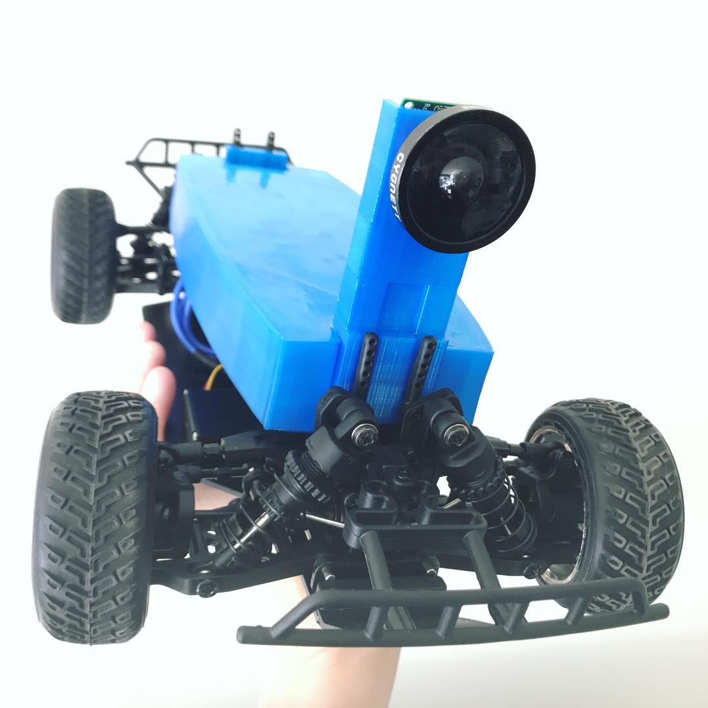
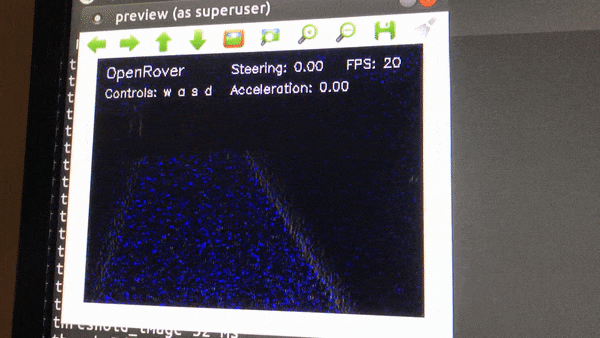

## OpenRover
### A Simple Self Driving Car System.

Featuring LaneVision™ Technology.

OpenRover runs on a Raspberry Pi 3, or an ODROID XU4.

It's designed for radio controlled cars.



It uses a webcam and OpenCV to detect lane lines and drive the car.

[Overview and context of the project](https://medium.com/australian-robotics-society/self-racing-cars-down-under-d6223af4fad0).

[How to build your own](https://medium.com/australian-robotics-society/build-your-own-self-racing-car-4204b30dc4d0).

# In Action

[First laps on a course](https://www.youtube.com/watch?v=114LnvbvpC8)

[Lap on a workshop course](https://www.youtube.com/watch?v=SkYWpN0lHF0)

[First random steps](https://www.instagram.com/p/BXrkQCCB8Qa/?taken-by=australianroboticssociety).

[Driving manually, and crashing](https://www.instagram.com/p/BX2N8v0BVw8/?taken-by=australianroboticssociety).

# LaneVision™
LaneVision™ is the system for determining where the lanes of the track are in the camera image, fitting polynomials to them, determining confidence factor with which the lanes have been found, and mapping them into world space.

It works thus:

First, we detect vertical edges.



Then, we threshold to be able to see only the detected lines.


Then, we run sliding windows up from the bottom of the image, re-adjusting the window position to center around the most detected line pixels.


Then we fit a polynomial to the window positions, and generate a centre line. 


We use the curve of the centre line to feed into the steering.

# Installation

```
cd install
./install
```

# Running
To start driving, run this.

```
./drive
```

# Driving

OpenRover serves its web interface from the device's IP address. Open a browser to e.g. http://10.0.0.2 and you will be able to manually drive the car with w, a, s, d keys from the page.


